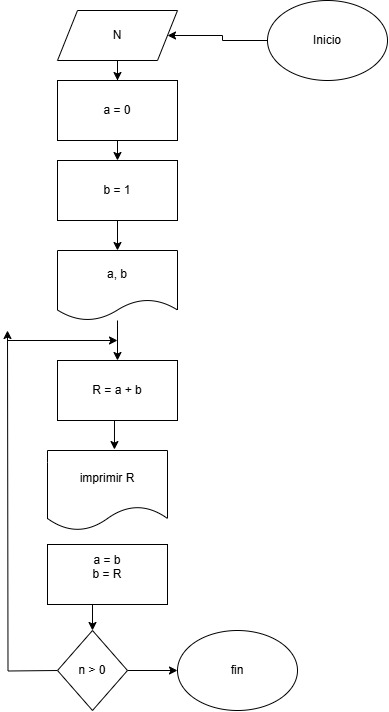

Realice un algoritmo para determinar cuánto se debe pagar por equis cantidad de 
lápices considerando que si son 1000 o más el costo es de $85 cada uno; de lo contrario, el precio es de $90.
Represéntelo con el pseudocódigo y el diagrama de flujo.

inicio
escribir "ingrese la cantidad de lapices que va a llevar" 
leer lapices
si lapices>=1000:
    costo = 85 * lapices
sino{
    costo = 90 * lapices
} 
escribir "el valor total es" costo
fin

Un almacén de ropa tiene una promoción: por compras superiores a $250 000 se les aplicará un descuento de 15%, de caso contrario, sólo se aplicará un 8% de descuento. Realice un algoritmo para determinar el precio final que debe pagar una persona por comprar en dicho almacén y de cuánto es el descuento que obtendrá. Represéntelo mediante el pseudocódigo y el diagrama de flujo.

inicio
escribir "ingrese el precio total de su compra"
leer precio
si precio > 250000:
    descuento = precio * 0.15
sino{
    descuento = precio * 0.08
}
escribir "su compra tendra un descuento asi que el total sera" descuento
fin

El director de una escuela está organizando un viaje de estudios, y requiere determinar cuánto debe cobrar a cada alumno y cuánto debe pagar a la compañía de viajes por el servicio. La forma de cobrar es la siguiente: si son 100 alumnos o más, el costo por cada alumno es de $65.00; de 50 a 99 alumnos, el costo es de $70.00, de 30 a 49, de $95.00, y si son menos de 30, el costo de la renta del autobús es de $4000.00, sin importar el número de alumnos.

inicio
escribir "ingrese el numero de alumnos"
leer alumnos

si alumnos >= 100:
    total = alumnos * 65
sino  alumnos >= 50:
    total = alumnos * 70
sino alumnos >= 30 :
    total = alumnos * 95
sino alumnos < 30 :
    total = 4000
escribir "el precio total a pagar por elviaje es de" total
fin

pseudocodigo de estaturas

inicio
escribir "ingrese el numero de estaturas"
leer numero

escribir "ingrese cada estatura"
leer estatur

diagrama de serie de fibonacci:

