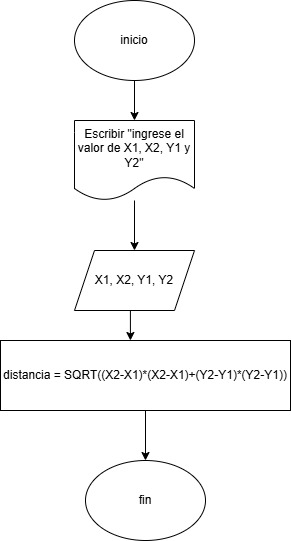
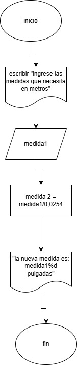
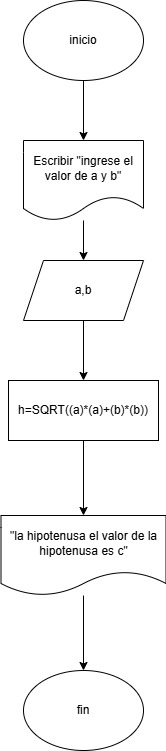

## Ejercicio 1

distancia entre dos puntos:  
```
inicio 
escribir "ingrese el valor de x1, x2, y1 y y2"
leer "x1, x2, y1, y2"
distancia = SQRT((x2-x1)*(x2-x1)+(y2-y1)*(y2-y1))
fin

```


## Ejercicio 2

pasar de metros a pulgadas:

```
inicio
escribir "ingrese las medidas que necesita en metros"
leer "medida1"
medida2 = medida1/0,0254
"su nueva medida en pulgadas va a ser medida2"
fin

```


## Ejercicio 3
calcular el valor de la hipotenusa
```
inicio
escribir "ingrese el valor de a y  b"
leer "a, b"
h=SQRT((a)*(a)+(b)*(b))
"el valor de la hipotenusa es h"
fin
```


## Ejercicio 4
calcular la edad de una persona
```
Inicio
Escribir "Ingrese su día de nacimiento:"
Leer diaNacimiento
Escribir "Ingrese su mes de nacimiento:"
Leer mesNacimiento
Escribir "Ingrese su año de nacimiento:"
Leer anioNacimiento
Escribir "Ingrese el día actual:"
Leer diaActual
Escribir "Ingrese el mes actual:"
Leer mesActual
Escribir "Ingrese el año actual:"
Leer anioActual
edad = anioActual - anioNacimiento
Si mesActual < mesNacimiento O mesActual = mesNacimiento Y diaActual < diaNacimiento Entonces
edad = edad - 1
Escribir "Aún no ha celebrado su cumpleaños este año."
Sino Si mesActual = mesNacimiento Y diaActual = diaNacimiento Entonces
Escribir "Feliz Cumpleaños"
Sino
Escribir "Ya ha celebrado su cumpleaños este año."
FinSi
Escribir "Su edad actual es: ", edad
Fin

```

## Ejercicio 5
determinar sueldo semanal
```
Inicio 
Escribir "Ingrese el número de horas trabajadas en la semana:
Leer horasTrabajadas
Escribir "Ingrese el pago por hora:"
Leer pagoPorHora
sueldo = 0
Si horasTrabajadas > 50 Entonces
Escribir "No está permitido trabajar más de 50 horas."
Sino
Si horasTrabajadas <= 40 Entonces
sueldo = horasTrabajadas * pagoPorHora
Sino
sueldo = 40 * pagoPorHora
Si horasTrabajadas > 40 Y horasTrabajadas <= 45 Entonces
sueldo = sueldo + ((horasTrabajadas - 40) * (pagoPorHora * 2))
Sino Si horasTrabajadas > 45 Y horasTrabajadas <= 50 Entonces
sueldo = sueldo + (5 * (pagoPorHora * 2))
sueldo = sueldo + ((horasTrabajadas - 45) * (pagoPorHora * 3)) 
FinSi
FinSi
Escribir "El sueldo semanal es: ", sueldo
FinSi
Fin
```

## Ejercicio 6
N cantidades 
```
Inicio
contadorCero ← 0
contadorPositivos ← 0
contadorNegativos ← 0
Escribir "Ingrese la cantidad de números a evaluar:"
Leer N
Si N <= 0 Entonces
Escribir "Debe ingresar un número mayor que 0."
Sino
Para i = 1 Hasta N Hacer
Escribir "Ingrese un número:"
Leer numero
Si numero = 0 Entonces
contadorCero ← contadorCero + 1
Sino Si numero > 0 Entonces
contadorPositivos ← contadorPositivos + 1
Sino
contadorNegativos ← contadorNegativos + 1
FinSi
FinPara
Escribir "Cantidad de números iguales a 0: ", contadorCero
Escribir "Cantidad de números mayores que 0: ", contadorPositivos
Escribir "Cantidad de números menores que 0: ", contadorNegativos
FinSi
Fin

```

## Ejercicio 7
ahorro de una persona diariamente
```
Inicio
ahorroDiario = 0.03
ahorroAnual = 0
Para dia = 1 Hasta 365 Hacer
Escribir "Día ", dia, ": ahorro de ", ahorroDiario, " pesos."
ahorroAnual = ahorroAnual + ahorroDiario
ahorroDiario = ahorroDiario * 3
FinPara
Escribir "El ahorro total en un año es: ", ahorroAnual, " pesos."
Fin

```